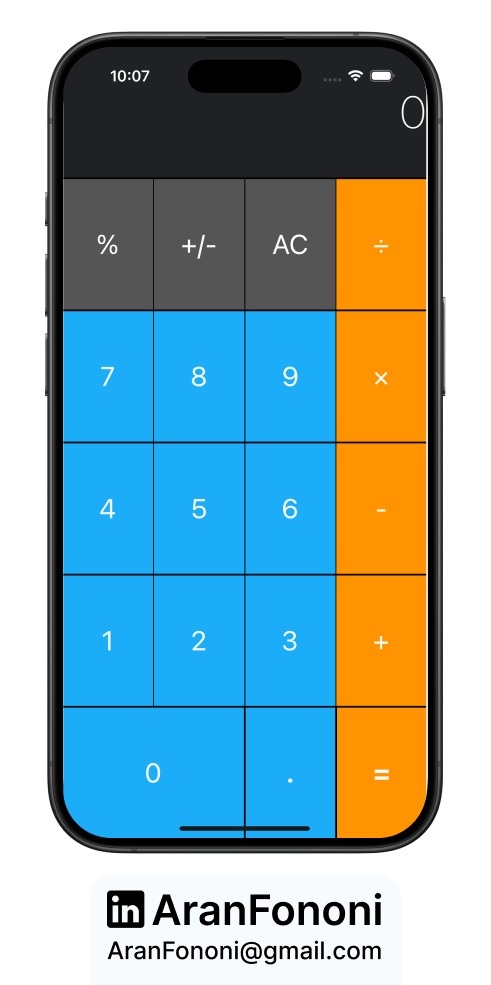
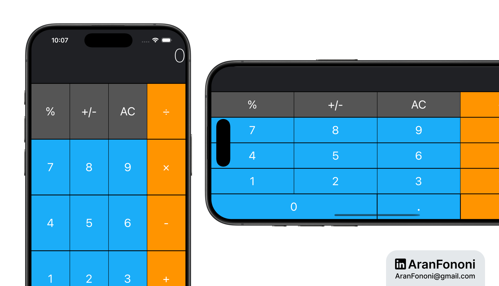

# Calculator App

### Project for Section 6: **Auto Layout and UIKit Essentials**  
This project was completed as part of Section 6 in the **Complete iOS Development Bootcamp** by Angela Yu.

## Project Overview
The **Calculator App** is a simple user interface designed to look like a basic calculator. While it doesn't perform calculations, it helps in learning Auto Layout and stack views in UIKit.

## What I Learned
In this project, I focused on:
- **Auto Layout Fundamentals**: Learned how to use constraints to position UI elements on different screen sizes.
- **Using Stack Views**: Used stack views to organize UI elements easily and adaptively.
- **Debugging Layout Issues**: Gained experience in troubleshooting and fixing Auto Layout errors.

## Key Skills
- Understanding Auto Layout
- Using stack views for organizing layouts
- Working with constraints for responsive design

---

### Project Preview

---

### Footer

---

## Contact
For more information, feel free to reach out:  
- **Email**: [aranfononi@gmail.com](mailto:aranfononi@gmail.com)  
- **LinkedIn**: [Aran Fononi](https://www.linkedin.com/in/aran-fononi-18182b265)
